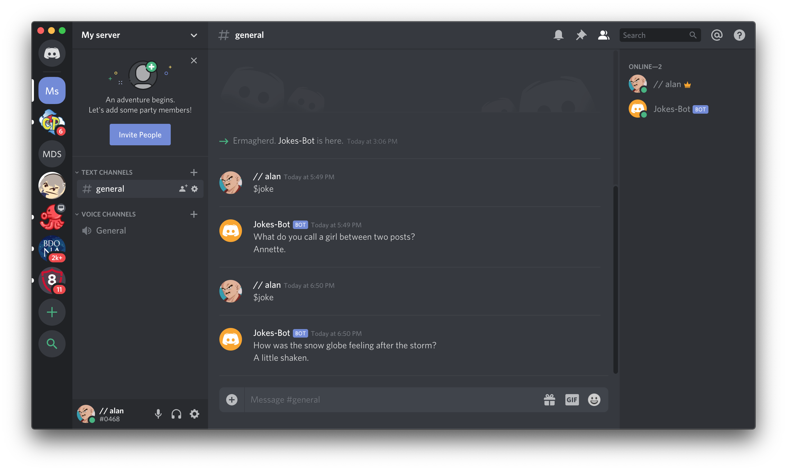

# discord-joke-bot
A simple Discord bot that I created with Python that tell jokes.

I created this bot for my [blog](https://blog.alanconstantino.com/).

I used the [Discord.py](https://discordpy.readthedocs.io/en/latest/) library as well as the [Official Joke API](https://github.com/15Dkatz/official_joke_api).

